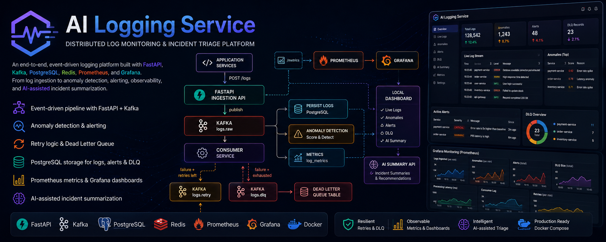
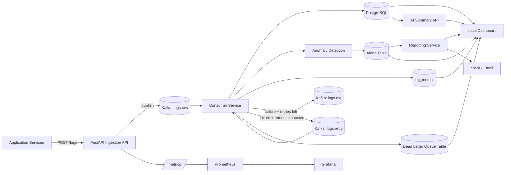
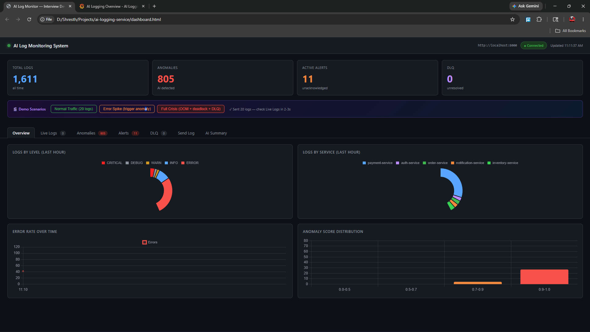
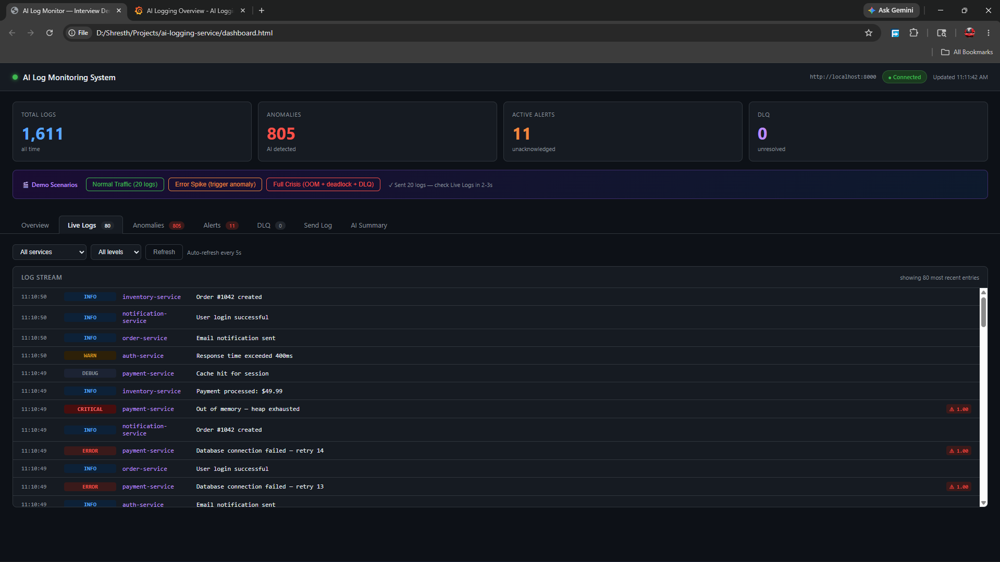
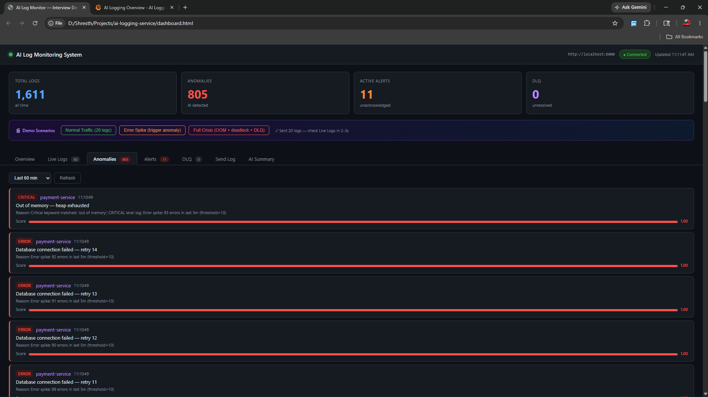
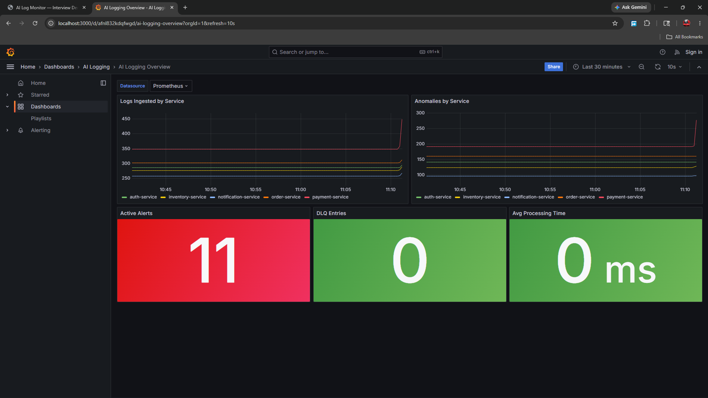
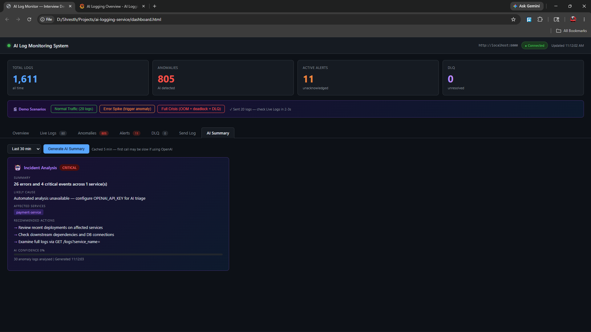

     

# AI Logging Service

Distributed log monitoring and incident triage platform built with FastAPI, Kafka, PostgreSQL, Redis, Prometheus, and Grafana.

It accepts logs over HTTP, pushes them through Kafka for asynchronous processing, detects anomalies, stores logs and alerts in PostgreSQL, surfaces operational metrics through Prometheus and Grafana, and provides a local dashboard for demoing the full workflow end to end.

This project is designed to show more than log ingestion. It demonstrates event-driven backend design, observability, retry and DLQ handling, and AI-assisted incident summarization in one system.

## Highlights

- Event-driven log pipeline using FastAPI + Kafka
- Background consumer for asynchronous processing
- Anomaly detection using keyword checks and error-spike rules
- Retry and dead-letter queue flow for failed messages
- PostgreSQL-backed queries for logs, alerts, and DLQ records
- On-demand and scheduled alert report generation
- Prometheus metrics and Grafana dashboards for observability
- AI-assisted incident summarization for anomaly triage
- Docker Compose setup for running the full stack locally

## Architecture



### Architecture Notes

- FastAPI handles ingestion and query APIs.
- Kafka decouples log ingestion from background processing.
- The consumer persists logs, scores anomalies, updates metric buckets, and triggers alerts.
- The reporting service can build alert summaries on demand or on a fixed schedule.
- Retry and DLQ paths make failures visible instead of silently dropping messages.
- Prometheus and Grafana provide operational visibility.
- The local dashboard is the interview/demo surface for logs, anomalies, alerts, DLQ entries, and AI summaries.

## Tech Stack

- FastAPI
- Kafka
- PostgreSQL
- Redis
- Prometheus
- Grafana
- SQLAlchemy
- Pydantic v2
- Docker Compose

## Screenshots

Real screenshots are included in the `screenshots/` folder. Replace the banner asset too if you want the top section to match the rest of the project visuals.

### Overview Dashboard

Shows total logs, anomalies, alerts, DLQ count, and recent system activity.



### Live Log Stream

Shows incoming logs with filters by service and level.



### Anomalies and Alerts

Highlights anomaly scores, alert severity, and triggered incidents.



### Grafana Monitoring

Shows Prometheus-backed operational metrics such as log volume, anomaly counts, alert totals, DLQ size, and processing latency.



### AI Summary

Shows AI-generated incident summaries, likely cause, affected services, and recommended next actions.



## Run locally

1. Create a `.env` file from `.env.example` if you want Slack, SMTP, or scheduled reporting.
2. Start the stack.
3. Verify the API health endpoint.

```bash
docker compose up -d --build
curl http://localhost:8000/health
```

API docs:

```text
http://localhost:8000/docs
```

Monitoring:

```text
Grafana:    http://localhost:3000
Prometheus: http://localhost:9090
Dashboard:  open dashboard.html
```

## Alerting And Scheduled Reports

The service supports both real-time alerts and periodic summary reports.

Real-time alerts:

- Slack via `SLACK_WEBHOOK_URL`
- Email via `SMTP_HOST`, `SMTP_PORT`, `SMTP_USER`, `SMTP_PASSWORD`, and `ALERT_EMAIL_TO`

Scheduled reports:

- `REPORT_SCHEDULER_ENABLED=true` turns the background scheduler on inside the API service
- `REPORT_SCHEDULE_SECONDS=3600` sends a report every hour
- `REPORT_SCHEDULE_CHANNELS=EMAIL,SLACK` chooses delivery targets
- `REPORT_SCHEDULE_SINCE_HOURS=24` controls the report window
- `REPORT_SCHEDULE_RUN_ON_STARTUP=true` optionally sends one report as soon as the API boots

Useful endpoints:

- `GET /reports/alerts` builds a report on demand
- `POST /reports/alerts/send` builds and sends a report immediately
- `GET /reports/scheduler/status` shows whether the periodic scheduler is enabled, when it ran last, and whether deliveries were skipped or sent

Example `.env` values:

```env
SLACK_WEBHOOK_URL=https://hooks.slack.com/services/your/webhook/id

SMTP_HOST=smtp.gmail.com
SMTP_PORT=587
SMTP_USER=your-email@example.com
SMTP_PASSWORD=your-app-password
ALERT_EMAIL_TO=team@example.com

REPORT_SCHEDULER_ENABLED=true
REPORT_SCHEDULE_SECONDS=3600
REPORT_SCHEDULE_RUN_ON_STARTUP=false
REPORT_SCHEDULE_SINCE_HOURS=24
REPORT_SCHEDULE_INCLUDE_ACKNOWLEDGED=false
REPORT_SCHEDULE_RECENT_LIMIT=10
REPORT_SCHEDULE_CHANNELS=EMAIL,SLACK
REPORT_SCHEDULE_SERVICE_NAME=
REPORT_SCHEDULE_SUBJECT=
```

After updating `.env`, restart the API container so the scheduler reloads the new settings:

```bash
docker compose restart ingestion-service
```

Quick verification commands:

```bash
curl http://localhost:8000/reports/alerts?since_hours=24
curl http://localhost:8000/reports/scheduler/status
```

## Sample usage

Send a log:

```bash
curl -X POST http://localhost:8000/logs
    -H "Content-Type: application/json"
    -d '{
        "service_name": "payment-service",
        "level": "ERROR",
        "message": "Database unavailable: connection pool exhausted",
        "trace_id": "trace-abc123",
        "environment": "production",
        "metadata": {
            "request_id": "req-1",
            "latency_ms": 1250
        }
    }'
```

Query stored logs:

```bash
curl "http://localhost:8000/logs?limit=20"
curl "http://localhost:8000/logs/anomalies?since_minutes=60"
```

Generate an alert report on demand:

```bash
curl "http://localhost:8000/reports/alerts?since_hours=24&recent_limit=5"
```

Send a report immediately:

```bash
curl -X POST http://localhost:8000/reports/alerts/send \
    -H "Content-Type: application/json" \
    -d '{
        "since_hours": 24,
        "recent_limit": 5,
        "channels": ["EMAIL", "SLACK"]
    }'
```

Generate demo traffic:

```bash
python simulate_logs.py --count 200 --delay 0.05
```

## Demo Walkthrough

If you want to show the project in an interview, this is the simplest demo flow.

### 1. Start the stack

```bash
docker compose up -d --build
```

Open these side by side:

- `dashboard.html`
- `http://localhost:3000` for Grafana
- `http://localhost:8000/docs` for API docs

### 2. Explain the architecture in one minute

Use this framing:

```text
Logs come into the FastAPI ingestion service, go through Kafka for asynchronous processing,
are consumed by a worker, analyzed for anomalies, stored in PostgreSQL, and then surfaced
through alerts, dashboards, and AI-assisted incident summaries.
```

### 3. Show the happy path

- Open the local dashboard overview
- Show total logs, anomaly counts, alert counts, and DLQ counts
- Open Grafana and show the monitoring panels

### 4. Trigger traffic

Use one of these:

```bash
python simulate_logs.py --count 100 --delay 0.05
```

Or use the built-in demo buttons in `dashboard.html`:

- `Normal Traffic`
- `Error Spike`
- `Full Crisis`

### 5. Show what changes in real time

- `Live Logs` updates as new events arrive
- `Anomalies` shows flagged logs with scores and reasons
- `Alerts` shows active incidents
- `GET /reports/alerts` gives you a management summary instead of raw incidents only
- Grafana reflects updated Prometheus metrics

### 6. Show resilience features

- Explain retries through `logs.retry`
- Explain failed-message handling through the DLQ
- Show `/dlq` if there are unresolved failures

### 7. Show the reporting layer

- Open `GET /reports/alerts` and explain the severity, service, and hourly trend breakdowns
- Open `GET /reports/scheduler/status` to show whether the background scheduler is active
- If Slack or SMTP is configured, trigger `POST /reports/alerts/send` and show the delivery result

### 7. Show AI-assisted triage

- Open the `AI Summary` tab in the dashboard
- Generate a summary for recent anomalies
- Explain that the system uses AI for incident summarization and operator guidance, with a rule-based fallback when no API key is configured

## Interview Summary

Short version:

```text
I built a distributed log monitoring and incident triage platform.
Logs are ingested through FastAPI, processed asynchronously with Kafka,
stored in PostgreSQL, monitored with Prometheus and Grafana, and enriched
with anomaly detection, alerting, DLQ handling, and AI-assisted summaries.
```

## Main API endpoints

| Method | Endpoint | Purpose |
| --- | --- | --- |
| POST | /logs | Ingest one log |
| POST | /logs/bulk | Ingest a batch of logs |
| GET | /logs | Query processed logs |
| GET | /logs/anomalies | View detected anomalies |
| GET | /logs/metrics/summary | View aggregated metrics |
| GET | /alerts | List active alerts |
| GET | /dlq | Inspect dead-letter records |
| GET | /health | Health check |

## Notes

- Kafka topics are created on startup.
- Database tables are created on startup.
- The repo includes a simulator for generating realistic test traffic.
- `app/` and `db/` are compatibility wrappers used by the Docker commands.

## Why this project matters

This project demonstrates practical backend engineering patterns that show up in real systems: async processing, service decoupling, observability, failure handling with retries and DLQs, anomaly detection, and a usable local developer workflow.